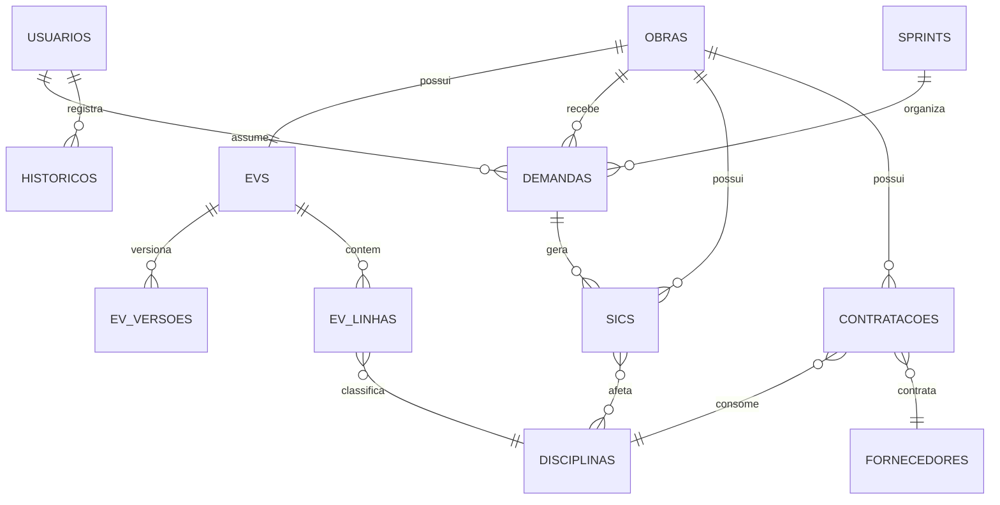

# Modelo Firebase e ER Lógico

## 1. Estratégia

O Firestore deve preservar a operação existente e corrigir a rastreabilidade financeira por disciplina.

O modelo passa a tratar a SIC como entidade central para alterações pontuais. Cada SIC deve apontar para uma ou mais disciplinas reais do dicionário canônico.

Diretrizes:

- Uma obra possui um único EV principal.
- O EV possui versões imutáveis em subcoleção.
- Linhas do EV são controladas por disciplina canônica.
- Deltas de versão são gravados em `diffPorDisciplina`.
- SICs gravam `disciplinasAfetadas`.
- Linha `SIC's` permanece apenas para compatibilidade histórica.
- Saldo é derivado, não armazenado como fonte de verdade.

## 2. ER Lógico



## 3. Coleções

### `obras/{obraId}`

```json
{
  "chaveUnica": "string",
  "codigoOriginal": "string",
  "nome": "string",
  "tipoUnidade": "string",
  "cidade": "string",
  "uf": "string",
  "regiao": "string",
  "classificacaoObra": "string",
  "tipologiaObra": "string",
  "areaConstruida": 0,
  "areaEquivalente": 0,
  "ordemInternaSAP": "string",
  "cnpj": "string",
  "endereco": "string",
  "status": "string",
  "evIdPrincipal": "evId",
  "criadoEm": "timestamp",
  "atualizadoEm": "timestamp"
}
```

Índices sugeridos:

- `regiao + status`
- `tipologiaObra + status`
- `codigoOriginal`
- `ordemInternaSAP`

### `evs/{evId}`

Um documento por obra.

```json
{
  "obraId": "obraId",
  "versaoAtual": 4,
  "valorTotalOrcado": 0,
  "valorTotalAditivado": 0,
  "valorTotalContratado": 0,
  "saldoTotal": 0,
  "custoPorM2": 0,
  "status": "Rascunho | Em cotação | Completo",
  "criadoEm": "timestamp",
  "atualizadoEm": "timestamp"
}
```

Regra:

```text
obraId deve ser único entre EVs principais.
```

### `evs/{evId}/versoes/{versaoId}`

Histórico imutável de versões.

```json
{
  "numero": 4,
  "data": "timestamp",
  "origem": "DEM-007",
  "valorTotal": 0,
  "custoM2": 0,
  "quemMotivo": "string",
  "diffPorDisciplina": [
    {
      "disciplinaId": "adequacoes-civis",
      "valorAntes": 0,
      "valorDepois": 9800000.00
    }
  ]
}
```

Regra central:

```text
diffPorDisciplina substitui qualquer item genérico como "Outras Linhas do EV".
```

### `evs/{evId}/linhas/{linhaId}`

```json
{
  "disciplinaId": "disciplinaId",
  "categoria": "CustosDaObra | OutrasCategorias",
  "valorOrcado": 0,
  "status": "Orçado | Cotado | Contratado | NãoSeAplica",
  "posicao": 1
}
```

Campos calculados:

```text
valorAditivado = soma de SICs aprovadas da disciplina
valorContratado = soma de contratações da disciplina
saldo = valorOrcado + valorAditivado - valorContratado
```

Esses campos podem ser materializados para performance, mas a fonte de verdade deve ser recalculável.

### `disciplinas/{disciplinaId}`

```json
{
  "nome": "string",
  "categoria": "CustosDaObra | OutrasCategorias",
  "posicao": 1,
  "ativo": true,
  "selecionavelParaSIC": true
}
```

Regras:

- `posicao` é imutável.
- Disciplinas não são excluídas.
- Novas disciplinas entram no final.
- `SIC's` deve ter `selecionavelParaSIC: false`.
- `Taxa de Risco (5%)` deve ter `selecionavelParaSIC: false`.

### `demandas/{demandaId}`

```json
{
  "obraId": "obraId",
  "tipo": "EmissaoInicial | SIC | ReemissaoCompleta",
  "sprintId": "sprintId",
  "analistaResponsavelId": "usuarioId",
  "analistasComplementaresIds": ["usuarioId"],
  "prioridade": "Alta | Média | Baixa",
  "coluna": "fazer | fazendo | pausado | validacaoST | validacaoObras | concluido | cancelado",
  "dataPrevistaInicio": "date",
  "dataInicioReal": "date",
  "dataPrevEnvioValidacaoObras": "date",
  "dataEnvioRealValidacaoObras": "date",
  "dataValidacaoObras": "date",
  "dataPrevistaEntrega": "date",
  "dataEntregaReal": "date",
  "observacao": "string",
  "sicIds": ["sicId"]
}
```

### `sprints/{sprintId}`

```json
{
  "nome": "string",
  "dataInicio": "date",
  "dataFim": "date",
  "status": "Planejada | Ativa | Encerrada"
}
```

### `sics/{sicId}`

Entidade central da correção.

```json
{
  "obraId": "obraId",
  "demandaId": "DEM-007",
  "disciplinasAfetadas": [
    {
      "disciplinaId": "adequacoes-civis",
      "valorDelta": 9800000.00
    }
  ],
  "motivo": "AlteracaoProjeto | SolicitacaoCampo",
  "descricao": "string",
  "documentoUrl": "string",
  "status": "Pendente | Aprovado | Reprovado",
  "aprovadoPor": "usuarioId",
  "dataAbertura": "timestamp",
  "dataAprovacao": "timestamp"
}
```

Validações obrigatórias:

- `disciplinasAfetadas` nunca pode ser vazio.
- Cada item deve ter `disciplinaId` selecionável para SIC.
- Cada item deve ter `valorDelta` válido.
- Não permitir disciplina genérica.

### `contratacoes/{contratacaoId}`

```json
{
  "obraId": "obraId",
  "disciplinaId": "disciplinaId",
  "fornecedorId": "fornecedorId",
  "valor": 0,
  "data": "date",
  "responsavelSuprimentos": "usuarioId",
  "numeroContrato": "string"
}
```

### `fornecedores/{fornecedorId}`

```json
{
  "razaoSocial": "string",
  "cnpj": "string",
  "contatoPrincipal": "string"
}
```

### `historicos/{historicoId}`

```json
{
  "entidade": "obra | ev | linhaEV | demanda | sic",
  "entidadeId": "string",
  "campo": "string",
  "valorAnterior": {},
  "valorNovo": {},
  "usuario": "usuarioId",
  "timestamp": "timestamp"
}
```

### `configuracoes/{chave}`

```json
{
  "nomenclaturasEV": {},
  "listasDeApoio": {},
  "taxaRiscoPadrao": 0.05
}
```

Listas de apoio:

- Analistas
- Tipos de unidade
- Classificação de obra
- Tipologia
- Tipo de atividade

### `usuarios/{uid}`

```json
{
  "nome": "string",
  "email": "string",
  "nivel": "Analista | Gestão | Administrador",
  "analistaVinculado": "string",
  "ativo": true,
  "criadoEm": "timestamp"
}
```

## 4. Consultas Analíticas Viabilizadas

### Custo por m² por disciplina

```text
soma(valorOrcado + valorAditivado aprovado da disciplina) / soma(areaEquivalente)
```

Segmentações:

- Disciplina
- Tipologia de obra
- Regional
- Tipo de unidade
- Período

### Volatilidade por disciplina

```text
volatilidade = soma(abs(valorDelta de SICs aprovadas)) por disciplina
```

### Desvio por disciplina

```text
desvio = (orçado atual - orçado inicial) / orçado inicial
```

## 5. Integração SAP

Campos a preservar desde o início:

- `ordemInternaSAP`
- `codigoOriginal`
- `numeroContrato`
- `fornecedorId`
- `cnpj`
- `disciplinaId`
- `valor`
- `statusIntegracao`
- `ultimaSincronizacao`
